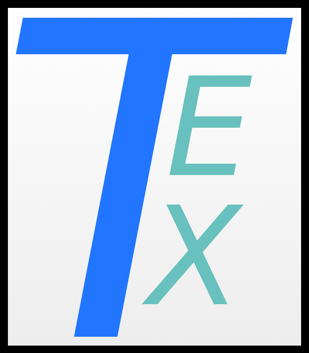

# The Tex Programming Language




Tex is a general-purpose dynamically-typed toy language written in Python. Tex's main goal is to be my first language and an exercise. As such, it's very simplistic and finicky.

## REPL Usage
The Tex Language includes a shell for executing Tex code and programs. If you'd like to use the repl itself run:
```
~$ python3 repl.py
```
To run a program from a file, specify the location of the file using "--file":
```
~$ python3 repl.py --file [path]
```
Tex programs are files with the '.tx' extension.

## Contributing
I'm open to contributions, however the changes should be run on your local machine first. There are no tests to run, as I feel this project is not in a place to require them.

## Licence
The MIT License (MIT)

Copyright (c) 2019 Ryan Danver (Visual-mov)

Permission is hereby granted, free of charge, to any person obtaining a copy of this software and associated documentation files (the "Software"), to deal in the Software without restriction, including without limitation the rights to use, copy, modify, merge, publish, distribute, sublicense, and/or sell copies of the Software, and to permit persons to whom the Software is furnished to do so, subject to the following conditions:

## Project Status
At this time, Tex is still in active development. I'm planning on continuing its development until 2020 or so.
